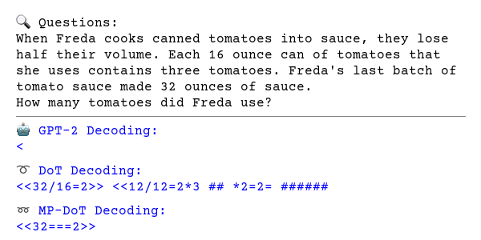
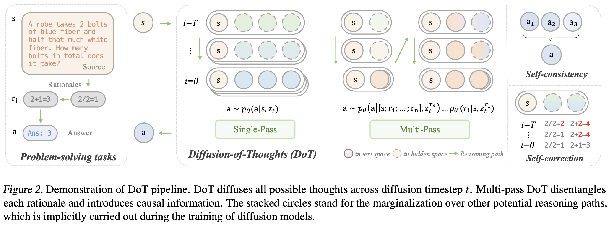
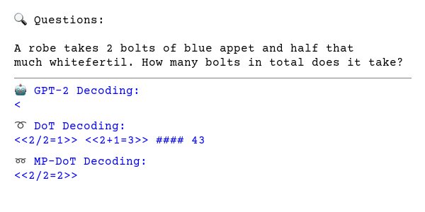
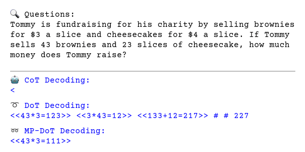

# Diffusion of Thoughts

<p align = "center">

</p>

<p align = "center">

</p>

This repository contains code for training and evaluating the models in the paper [Diffusion of Thoughts: Chain-of-Thought Reasoning in Diffusion Language Models](https://arxiv.org/abs/2402.07754).

- Diffusion models have gained attention in text processing, offering many potential advantages
over traditional autoregressive models. We explore the integration of diffusion models and Chain-of-Thought (CoT), a well-established technique to improve the reasoning ability in autoregressive language models. 
- We propose Diffusion-of-Thought (DoT), allowing reasoning steps to diffuse over time through the diffusion process. In contrast to traditional autoregressive language models that make decisions in a left-to-right, token-by-token manner, DoT offers more flexibility in the trade-off between computation and reasoning performance. 
- Additionally, DoT showcases promising self-correction abilities and benefits from existing reasoning-enhancing techniques like self-consistency decoding. Our findings contribute to the understanding and development of reasoning capabilities in diffusion language models.

<p align = "center">

</p>
<p align = "center">
DoT pipeline demonstration.
</p>

Our implementation of DoT is mainly based on [DiffuSeq](https://github.com/Shark-NLP/DiffuSeq) (*DiffuSeq: Sequence to Sequence Text Generation With Diffusion Models*) and [Plaid](https://github.com/igul222/plaid) (*Likelihood-Based Diffusion Language Models*). Our tasks and dataset configurations primarily follow the guidelines set by [Implicit CoT](https://github.com/da03/implicit_chain_of_thought). Thanks for these excellent work!

## Setup
All required packages can be found in requirements.txt. You can install them in a new environment with
```
conda create -n dot python=3.10
conda activate dot

git clone git@github.com:HKUNLP/diffusion-of-thoughts.git

# The following line to be replaced depending on your cuda version.
cd diffusion-of-thoughts
pip install -r requirements.txt -f https://download.pytorch.org/whl/torch_stable.html
```

Install NVIDIA Apex with fused kernels:
```
git clone https://github.com/NVIDIA/apex
cd apex
git checkout 2386a912164b0c5cfcd8be7a2b890fbac5607c82
pip install -v --disable-pip-version-check --no-cache-dir --no-build-isolation --config-settings "--build-option=--cpp_ext" --config-settings "--build-option=--cuda_ext" ./

```

## Finetuning from Plaid 1B
First download the weights from here: [Plaid 1B Weights Download Page](https://github.com/igul222/plaid/releases/tag/v1.0.0). Download data from here: [4by4/5by4/GSM8k-Aug data](https://github.com/da03/implicit_chain_of_thought/tree/main/data) and put them in the ./data folder with names 4by4/5by5/gsm8k.

Extract them:
```
cat plaid1b_weights.tar.gz.* | tar xvzf -
```

Then run the following code:

```
# DoT
python train.py --digit --fix_src --dataset gsm8k --steps 120000 --weights_path plaid1b_weights 

# DoT-MP
python train.py --digit --fix_src --cot --dataset gsm8k --steps 31000 --weights_path plaid1b_weights 
```

Please refer to `run_train.sh` for more training commands.


## Evaluation
Here are some commands for evaluation and please refer to `run_eval.sh` for more examples.
```
# dot (T=64 by default)
python3 evaluation_batch.py --weights_path outputs/gsm8k-bs128-fix_src-digit-steps120000 --fix_src --digit --dataset gsm8k --score_temp 0.5

# dot dpmsolver 
python3 evaluation_batch.py --weights_path outputs/gsm8k-bs128-fix_src-digit-steps120000 --fix_src --digit --dataset gsm8k --dpm_solver

# dot T=8
python3 evaluation_batch.py --weights_path outputs/gsm8k-bs128-fix_src-digit-steps120000 --fix_src --digit --dataset gsm8k --score_temp 0.5 --sampling_timesteps 8

# mp-dot
python3 evaluation_batch.py --weights_path outputs/gsm8k-bs128-fix_src-cot-digit-steps31000 --fix_src --digit --cot --dataset gsm8k --score_temp 0.5

```


Pretrained checkpoints are under policy checking and we will release them as soon as possible...

## Finetuning from SEDD
### Environment Setup
#### 🐳 Docker

We recommend to setup the environment with our docker [image](https://hub.docker.com/r/simonlemaqwq/sedd), which will prepare the whole environment and ease your reproduction with minimal effort.

```bash
# Pull the image for finetuning on LLaMA2 from dockerhub
docker pull simonlemaqwq/sedd:v2.0

# Start the container, remember to replace <PROJECT_DIR> with your own project directory
docker run \
    --name sedd \
    --gpus all \
    --network=host \
    -v <PROJECT_DIR>:/workspace \
    -it simonlemaqwq/sedd:v2.0 /bin/bash

# Switch to the branch for Diffusion of Thoughts - SEDD
cd /workspace
git checkout dot-sedd
```


#### 🐍 Conda
If you use the above docker image, this step can be skipped, because the conda env has been well prepared in it. Please also refer to the original <a href="https://github.com/louaaron/Score-Entropy-Discrete-Diffusion" target="_blank">SEDD</a> repo for more detailed conda environment setup instruction!
```bash
# Create and activate conda environment
conda env create -f environment.yml
conda activate sedd

# Install required dependencies
pip install -r requirements.txt
```

### Dataset Preparation
Download data from here: [GSM8k-Aug data](https://github.com/da03/implicit_chain_of_thought/tree/main/data) and put them in `./data/gsm8k`

Parse the dataset:
```bash
python parse_dataset.py --input_dir data/gsm8k --output_dir data/gsm8k
```


### Finetune
All configurations for finetuning should be set in `configs/config.yaml`.

Switch to `DoT` or `DoT_MP` as follows:
```yaml
data:
  multipass: False # (Ture if use DoT_MP)
```

Then simply run:
```bash
python finetune.py
```

This creates a new directory `direc=exp_local/DATE/TIME` and saves the checkpoint and log.

### Inference
Specify the `--model_path` in the script before sampling.
```bash
# e.g. --model_path /workspace/exp_local/gsm8k/<date>/<ckpt_dir>

# For DoT:
bash run_sample_cond.sh

# For DoT-MP
bash run_sample_cond_mp.sh
```

### Evaluation
Specify the `--generated_output_path` in the script.
```bash
# e.g. --generated_output_path generated_output/gsm8k/<ckpt_dir>
bash run_cal_accuracy.sh
```


## More Cases
<p align = "center">

</p>
<p align = "center">

</p>
<p align = "center">

</p>

## Citation
```
@article{ye2024diffusion,
  title={Diffusion of Thoughts: Chain-of-Thought Reasoning in Diffusion Language Models},
  author={Ye, Jiacheng and Gong, Shansan and Chen, Liheng and Zheng, Lin and Gao, Jiahui and Shi, Han and Wu, Chuan and Li, Zhenguo and Bi, Wei and Kong, Lingpeng},
  journal={arXiv preprint arXiv:2402.07754},
  year={2024}
}
```